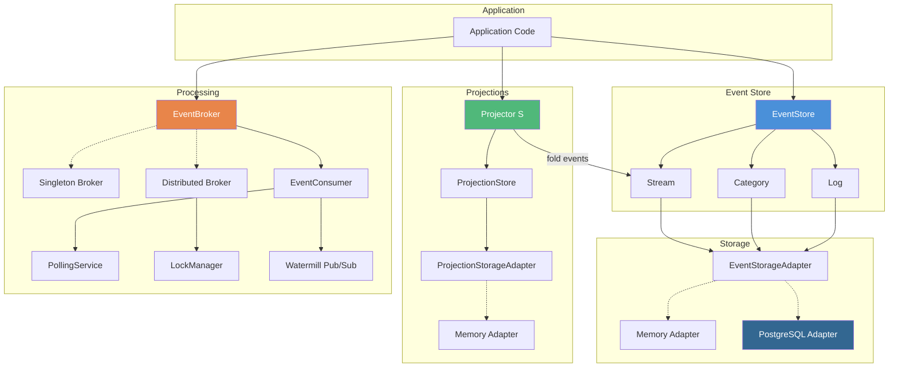
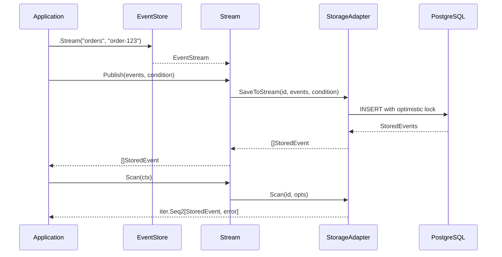
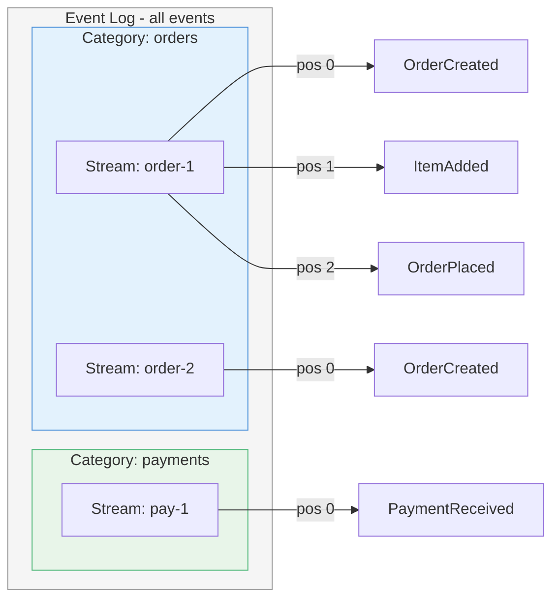
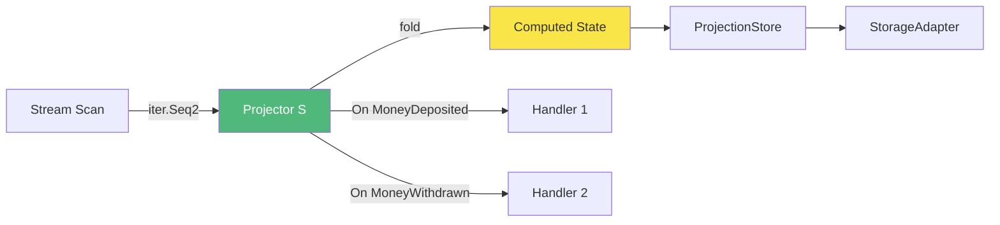
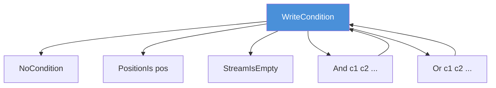
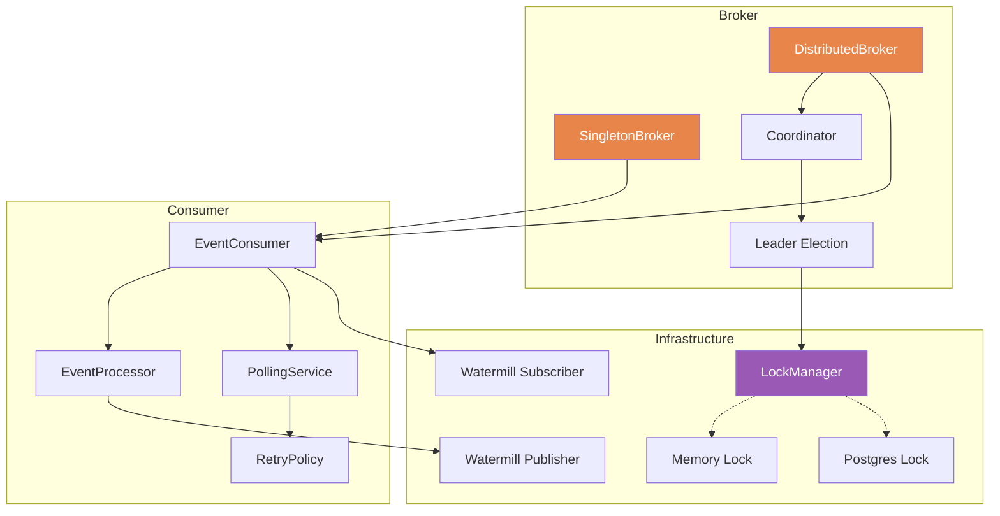
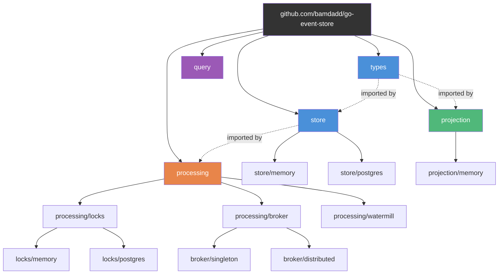

# Architecture

## High-Level Overview

## Event Lifecycle

## Event Organisation

## Projection Flow

## Write Conditions

Optimistic concurrency is enforced via composable write conditions evaluated before each write.

## Processing Pipeline

## Package Structure

